# Atlas

## Description
**Atlas** is a mobile app that helps travellers plan and record trips by creating, sharing, and organizing itineraries, budget, and schedules in one centralized app. Track and preserve trip memories via a visual map-based itinerary, attach images and notes to enrich each location, and explore trips created by other people through personalized tagging and filtering.

## Features
- Trip Management: Create and organize trips with detailed itineraries.
- Interactive Pins: Mark locations, add photos, and write notes for specific places.
- Explore Community: Discover trips shared by other travelers.
- User Profiles: Manage your travel preferences, stats, and style.
- Cross-Platform: Unified codebase for Android and JVM (Desktop) platforms.
- Cloud Powered: Seamless data synchronization using Supabase (Auth, Database, and Storage).

## Tech Stack
- Language: Kotlin
- UI Framework: Compose Multiplatform
- Backend: Supabase (PostgreSQL, Auth, Storage)
- Networking/Serialization: Kotlinx Serialization, Supabase-kt
- Architecture: MVVM (Model-View-ViewModel) with Repository Pattern
- Dependency Management: Gradle Version Catalogs

Screenshot of main screen/window: 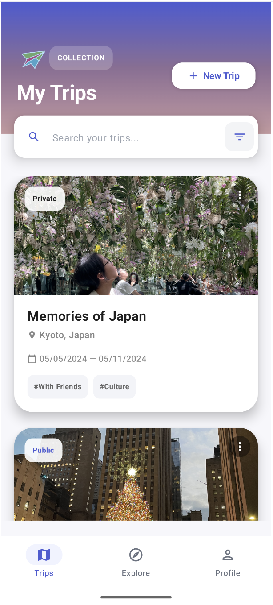

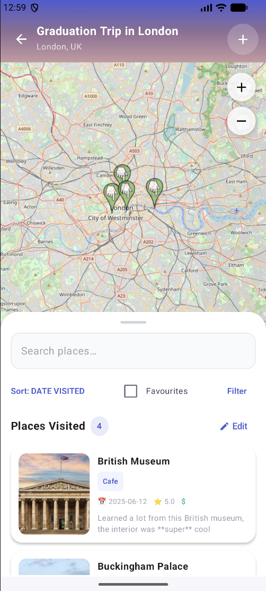

## Getting Started 
### Prerequisites
- Android Studio or IntelliJ IDEA
- JDK 17 or higher
- Android SDK (for Android builds)
### Build & Run
**Android**

```
./gradlew :composeApp:installDebug
```

**Desktop (JVM)**

```
./gradlew :composeApp:run
```

## Backend Configuration
The project uses Supabase for backend services. Configuration is managed in SupabaseClient.kt. For a production setup, ensure your Supabase URL and Key are correctly configured in local.properties or environment variables as defined in build.gradle.kts.

## Atlas Usage Guide

Welcome to Atlas, your personal companion for planning journeys and preserving travel memories. This guide will walk you through the essential features of the app.

### 1. Getting Started

To begin, you must create a secure account. Atlas uses Supabase to sync your trips across devices.

* **Create an Account:** Tap "Create Account" on the sign in screen. Enter your name, email and a password (minimum 6 characters).
* **Sign In:** If you already have an account, enter your credentials.

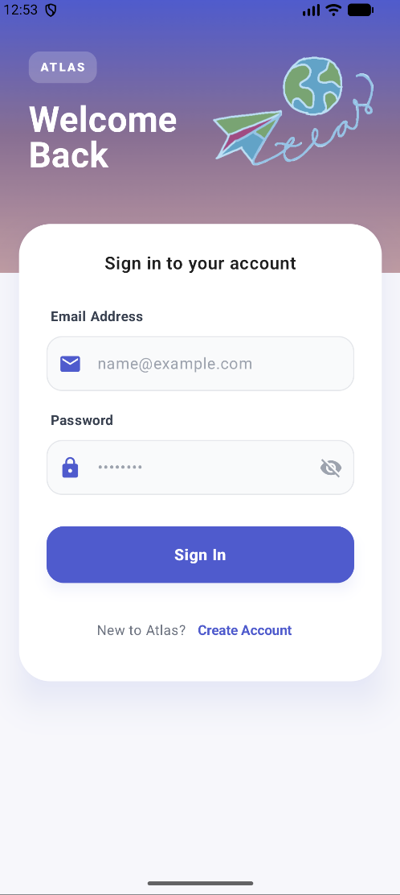


---

### 2. Managing Your Trips

The My Trips screen is your personal command center. Here you can see all your upcoming and past adventures.

* **Create a New Trip:** Tap the "+ New Trip" button in the top right corner of the "Trips" tab to open the Create Trip dialog. Give your trip a name, destination, and select your travel dates. Optionally, you may also attach an image to be the cover photo and add tags to categorize your trip type.
* **Set Visibility:** Choose "Private" if you want the trip for your eyes only, or "Public" to share your recommendations with the Atlas community.
* **Search & Filter:** Use the search bar at the top to find specific trips by name or destination. Tap the filter icon to narrow down your view by trip visibility, date range, and tags such as "Solo", "Foodie" or "Adventure."
* **Edit an existing trip:** Click the three dots on the top right corner of a trip card to edit the details of it.

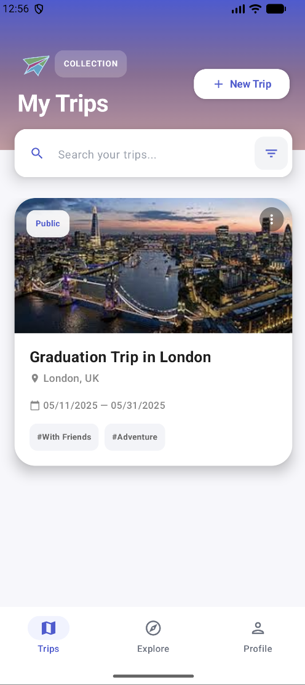
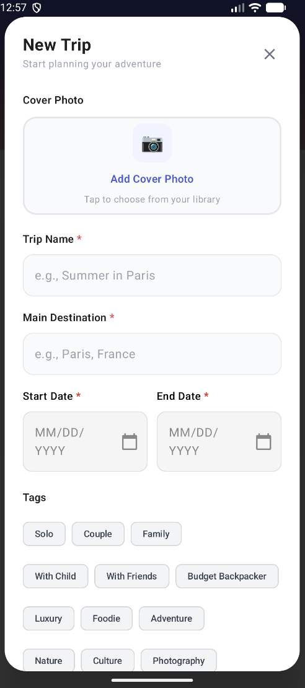
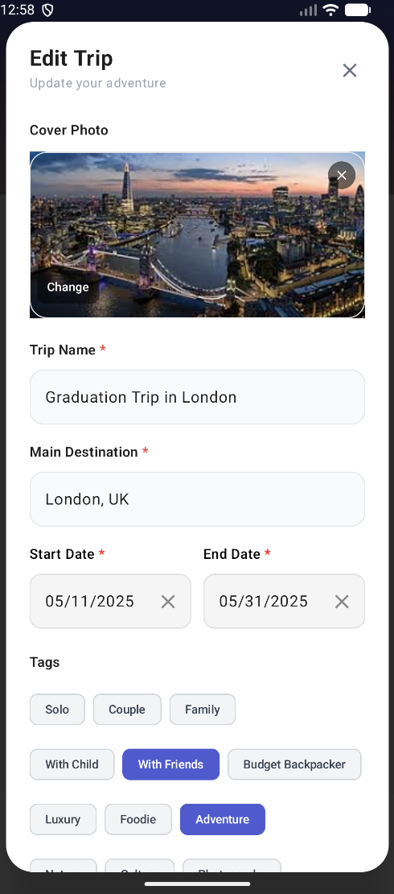
---

### 3. Documenting Your Journey (Pins)

Tap any trip to enter the Single Trip View. This is where you document specific locations/places you plan to visit or have visited, referred to as Pins.

* **The Interactive Map:** View all your pins geographically. Tap a pin on the map to automatically scroll to and highlight its place card in the "Places Visited" list below. If the map is in full screen view, tap the pin twice to expand the bottom sheet with the places visited list.
* **Add a Place:** Tap the "+" button in the top right of the Single Trip View Screen to add a new pin/place to the current trip. See section 4 below for more details about the add/edit pin screen; fields with a red star (\*) are mandatory.
  * **Smart Place Search:** When adding a pin, simply start typing the name of a location in the "Search Place" box. Atlas features an Autocomplete Search that suggests real-world places, businesses, and attractions.
  * **Automatic Address Pinning:** Selecting a place from the search results automatically populates the Exact Address and coordinates. Atlas then provides a Map Preview within the form so you can verify the location before saving.
  * **Markdown Support for Notes:** Share your experience using full Markdown formatting. Use **Bold** (\*\*text\*\*), _italics_ (\*text\*), Links, dividers (---), or lists to organize your memories.
* **Search & Filter:** Use the search bar at the top of the bottom sheet to find specific trips by name or destination. Tap the sort icon to sort by date visited, rating, pin name, favourite/not favourited, category. Tap the filter icon to narrow down your list based on pin category. Check the middle favourites checkbox to only view favourited pins.
* **Delete multiple pins:** Click the Edit button under Filter to select multiple pins to delete.


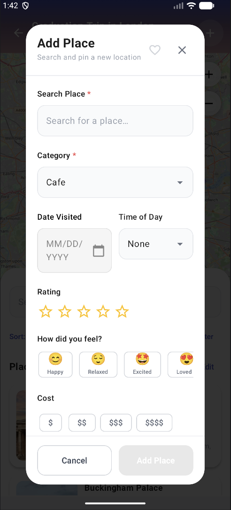
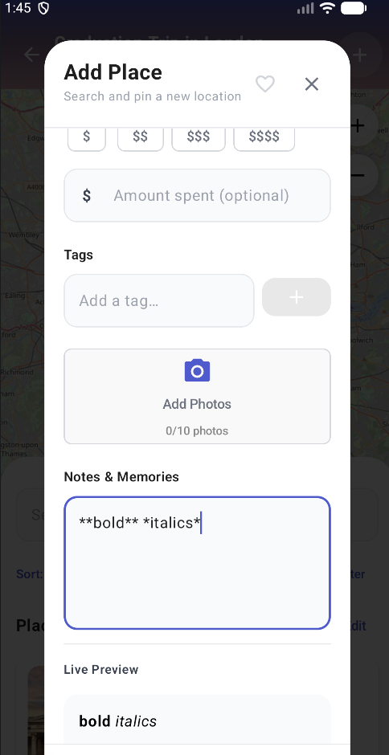
---

### 4. Deep Dive: The Single Pin Screen

Double tap on a specific place card in your "Places Visited" list (or tap once more if it is already highlighted in blue) to open the Single Pin Screen. This is the heart of your travel memories.

#### 4.1 Viewing Your Memories

* **Rich Metadata:** At a glance, see the category, visit date, time of day (e.g., :sunrise: Morning), and your "Mood" emoji (e.g., :blush: Happy).
* **Ratings & Cost:** Review your 5-star rating, the price level ($ to $$$$) and the specific amount spent you recorded for that spot.
* **Photo Gallery:** View all photos for this location. Tap any image to see its whole image and read its specific caption.
* **Formatted Notes:** Read your personal "Notes & Memories" with full support for bold text, lists, and clickable web links, etc.

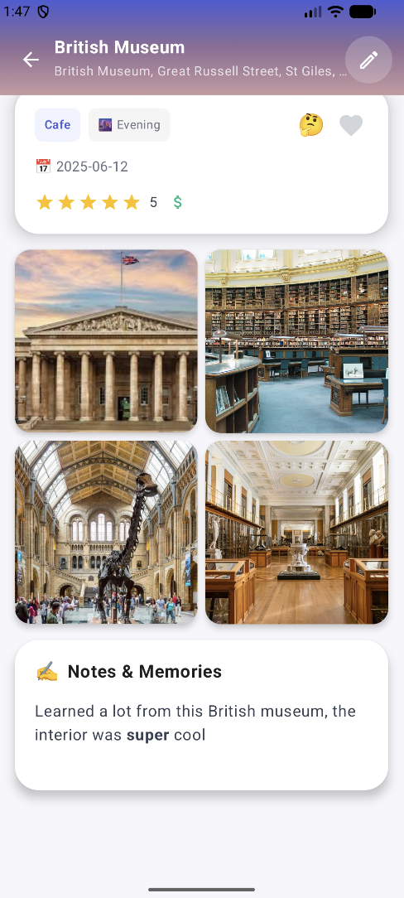


#### 4.2 Editing and Refining

If the trip belongs to you, tap the Pencil Icon in the top right to enter Edit Mode:

* **Metadata Editor:** Tap "Edit Details" to expand a form where you can update the category, tags, price, or other metadata fields.
* **Live Markdown Preview:** As you type in your notes, a "Live Preview" appears below the text field, showing exactly how your formatted text will look.
* **Manage Photos:** Add or remove photos, add/edit captions to individual images, and select which image should be the "Cover" for this specific pin.

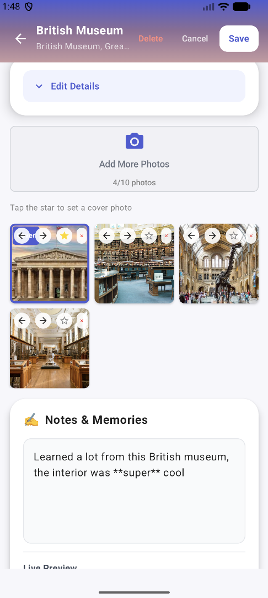
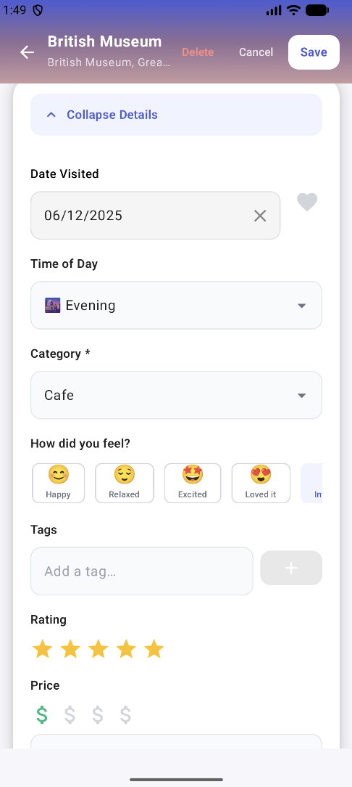

---

### 5. Exploring the Community

The Explore tab allows you to discover public trips created by other travelers.

* **Discover:** Browse the community feed. Tap any trip to see the recommendations and pins added by other users.
* **Search & Filter:** Use the search bar at the top of the page to find specific trips by trip name or destination. Tap the filter icon on the right to narrow down trips by start/end date and tags. 
* **Save for Later:** Tap the "bookmark" icon on any trip. Saved trips appear in a dedicated section (at the bottom) on your profile for easy access later.
* **View Author Profiles:** Tap an author's name to see their travel stats and other public journeys they have shared.

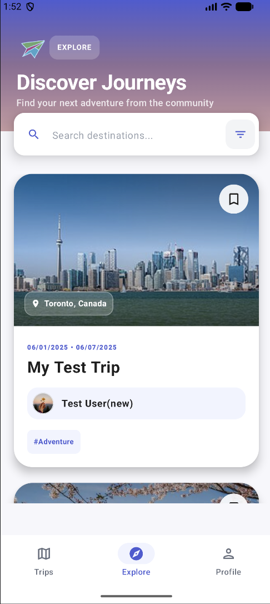
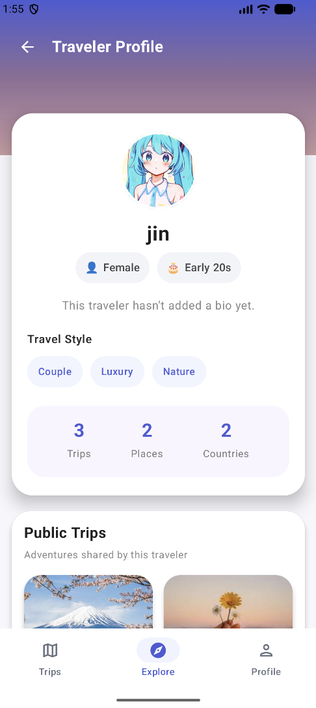
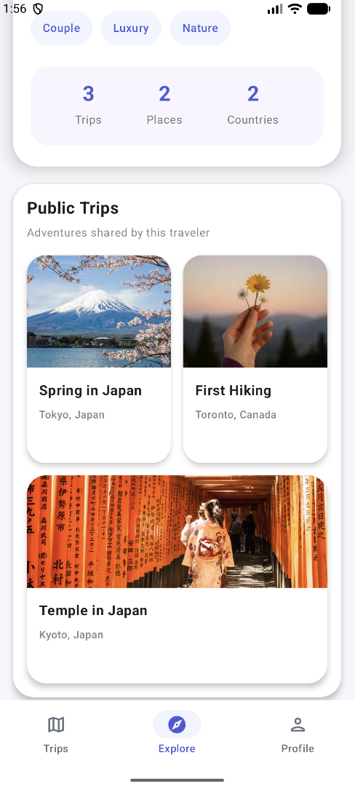

---

## 6. Personalizing Your Profile

Your Profile tab tracks your growth as a traveler.

* **Travel Stats:** Atlas automatically calculates how many trips you've taken, unique places you've pinned, and countries you've visited.
* **Edit Profile:** Tap the edit button on the profile tab to edit your personal profile.
  * **Demographic & Travel Style:** Edit your profile to select your profile picture, display name, bio, gender, age range and tags that describe your style (e.g., "Photography," "Budget," "Nature"). This helps others know your demographic and what kind of recommendations to expect from you.
* **Logout:** Tap the logout button to sign out of your account. This brings you back to the sign in page.
* **Access Saved Content:** Scroll down to find all the trips you've saved from the Explore tab.

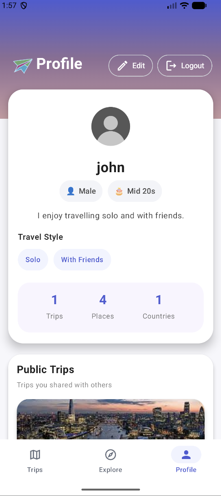
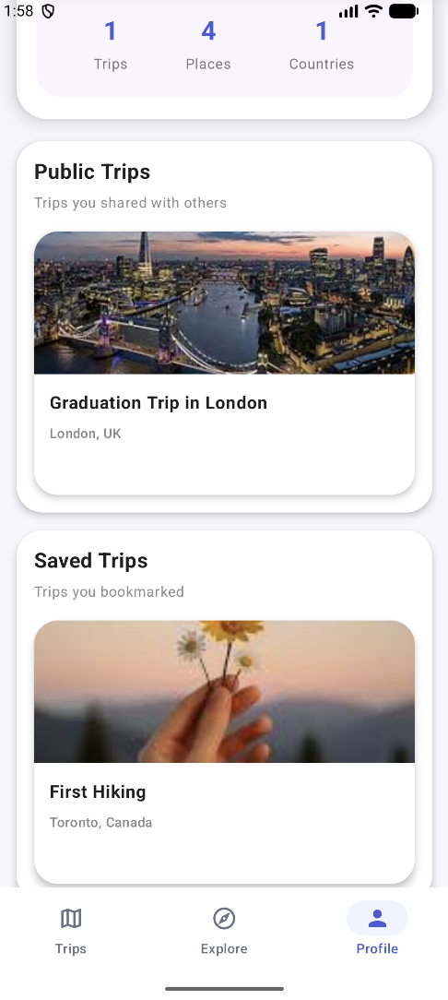
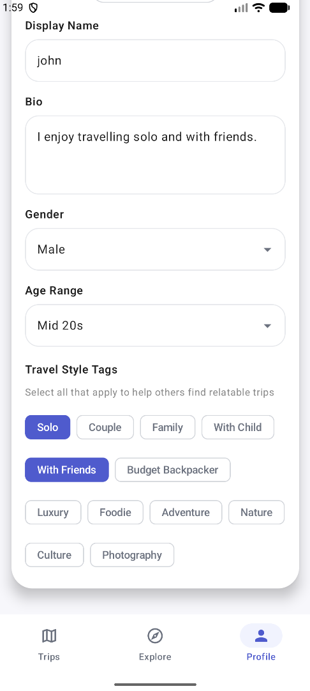
